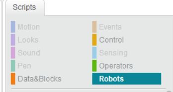

###mBlock

1.Download,install and open mBlock

url -http://www.mblock.cc/software/mblock/mblock3/

2.Insert MakeBlock USB Device

3.Turn on the mBot and connect via 2.4G serial

4.Open the robot scripts
 
 
 
5.Open the arduiono mode window

6.Drag and drop commands 

7.Switch settings around and duble click to run it

8.In the arduino window you can see the commands 
 
!(Arduino code) [arduino_code.jpg]