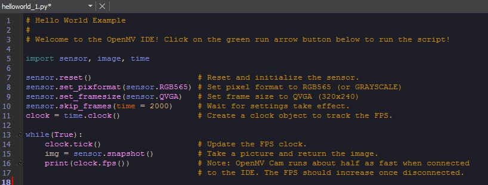
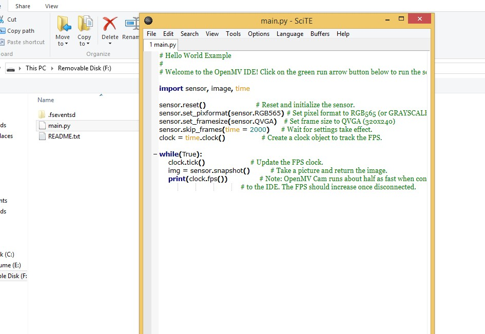
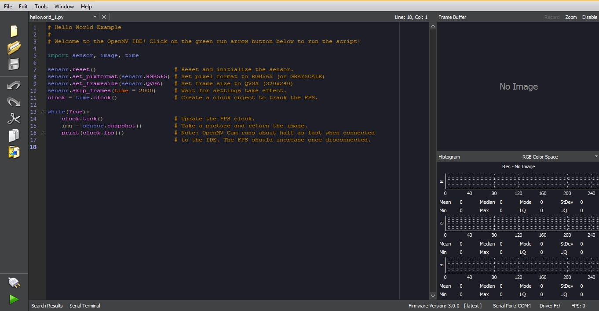
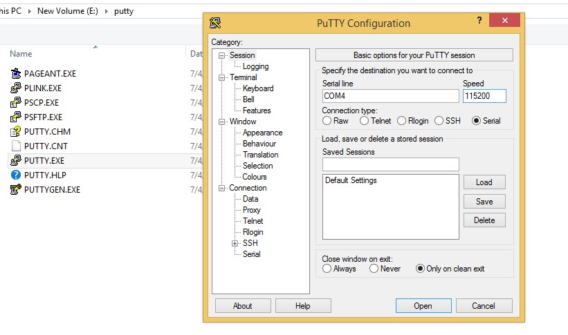
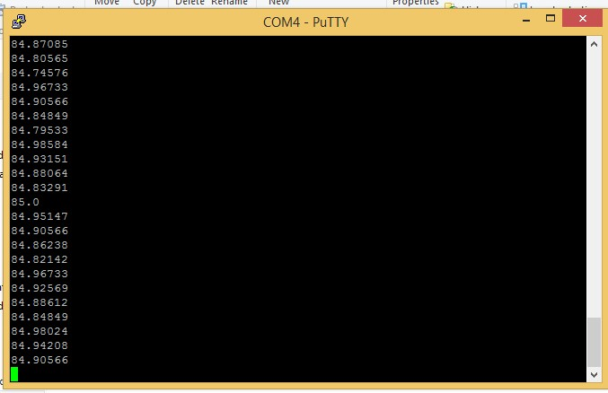

### Citirea informatiilor de pe camera din sistemul de operare printr-un serial port

#### 1.Instalarea IDE-ului [OpenMV](https://openmv.io/pages/download)

Dupa asta, conectam camera la calculator printr-un cablu USB

#### 2.Coierea programului helloworld din OpenMV in main.py-ul camerei

Dupa ce il copiem folosind un text editor cum ar fi, SciTE, salvam fisierul si dam eject la drive urmand sa conectam din nou camera la calculator.

#### 3.Verificarea Serial Port-ului in OpenMV

Acesta se poate gasi in coltul din dreapta jos al IDE-ului.

#### 4.Instalarea PuTTY-ului si utilizarea lui

[PuTTY](https://www.chiark.greenend.org.uk/~sgtatham/putty/latest.html)

Vom lua versiunea de putty.zip de la Alternative binary file dupa care vom deschide PUTTY.exe unde va trebui sa introducem Serial Port-ul si Speed-ul camerei.
Speed-ul este 115200 iar Port-ul se gaseste in primul pas.

